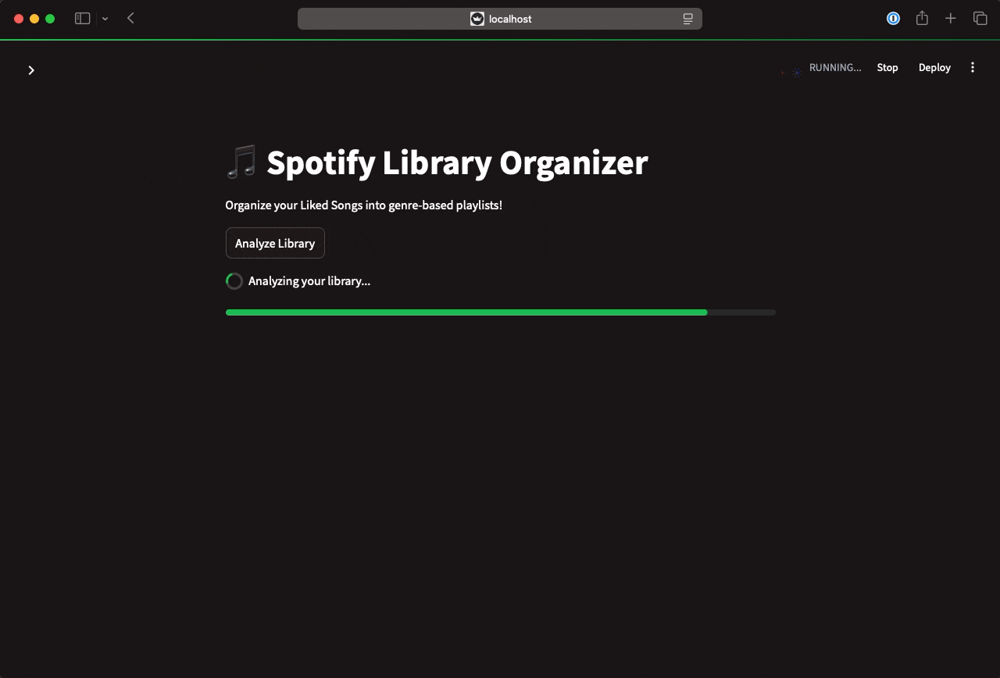

# Spotinizer - The Spotify Library Organizer

A Streamlit application that helps you organize your Spotify Liked Songs into genre-based playlists automatically. The app analyzes your liked songs, categorizes them by genre, and creates custom playlists based on these categories.

## Features

- 🎵 Automatic genre detection and categorization
- 🔍 Duplicate song detection and removal
- 📝 Customizable playlist settings
- 🎨 Clean, modern interface with Spotify-inspired design
- 📱 Responsive layout that works on desktop and mobile

## Prerequisites

- Python 3.9+ or Docker
- A Spotify Developer Account

## Quick demo


## Setup

### 1. Spotify API Credentials

1. Go to the [Spotify Developer Dashboard](https://developer.spotify.com/dashboard)
2. Create a new application
3. Note down your `Client ID` and `Client Secret`
4. Add `http://localhost:8501` to your application's Redirect URIs

### 2. Configuration

Create a `.streamlit/secrets.toml` file in the project directory with your Spotify credentials:

```toml
[spotify]
client_id = "your_client_id"
client_secret = "your_client_secret"
redirect_uri = "http://localhost:8501"
```

### 3. Installation

#### Option 1: Local Installation

1. Clone the repository:
```bash
git clone https://github.com/yourusername/spotify-library-organizer.git
cd spotify-library-organizer
```

2. Install dependencies:
```bash
pip install -r requirements.txt
```

3. Run the application:
```bash
streamlit run spotify_organizer.py
```

#### Option 2: Docker Installation

1. Build the Docker image:
```bash
docker build -t spotify-organizer .
```

2. Run the container:
```bash
docker run -p 8501:8501 -v $(pwd)/.streamlit:/root/.streamlit spotify-organizer
```

## Usage

1. Open your browser and navigate to `http://localhost:8501`
2. Click "Connect to Spotify" and authorize the application
3. Use the hamburger menu in the top-right to access settings
4. Click "Analyze Library" to start organizing your music
5. Review and customize the generated playlists
6. Click "Create/Update Selected Playlists" to save to your Spotify account

## Customization

### Genre Categories

You can customize genre categories through the UI by:
1. Opening the sidebar (hamburger menu)
2. Expanding "Genre Categories"
3. Clicking "Edit Genre Rules"
4. Modifying the JSON configuration

Default categories include:
- Rock
- EDM
- Hip Hop
- Pop
- Jazz
- Classical
- R&B

### Playlist Settings

Customize playlist creation through the UI:
- Playlist name template
- Public/Private visibility
- Custom descriptions

## Contributing

Contributions are welcome! Please feel free to submit a Pull Request.

## License

This project is licensed under the MIT License - see the LICENSE file for details.

## Disclaimer

This application is not affiliated with, maintained, authorized, endorsed, or sponsored by Spotify.
